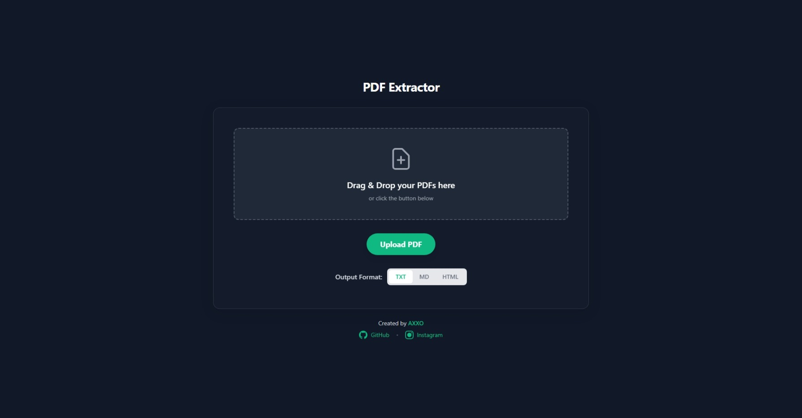
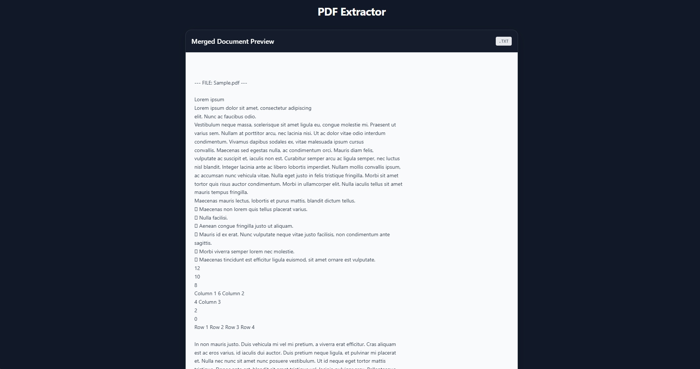
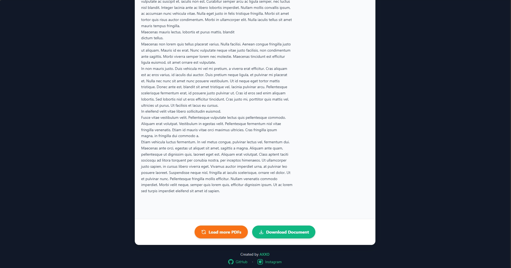

# 📄 Shadow PDF | by - AXXO


A minimalist, privacy-first tool designed to extract text from PDF documents instantly. Built for developers and security-conscious users who need fast conversions without the risk of data leakage.

---

## 📸 Previews







---

## 🔥 Key Features

- **100% Offline Processing:** All logic runs locally in your browser. No files are uploaded to any server, ever.
- **Multi-Format Export:** Seamlessly convert PDF content into:
  - **Plain Text (.txt)** for raw data.
  - **Markdown (.md)** for documentation and GitHub.
  - **HTML (.html)** for web ready-formatting.
- **Drag & Drop Interface:** Optimized UI for batch handling and speed.
- **Zero Dependencies:** Ultra-lightweight and browser-deployable with no heavy setup required.

---

## 🛠️ Installation & Usage

- This tool is entirely browser-deployable. No complex setup or servers required.

### Option 1: The Quick Start (Download Zip)
1.  Click the green **Code** button at the top of this repository.
2.  Select **Download ZIP** and extract the files.
3.  Double-click `index.html` to launch instantly in your browser.

### Option 2: The Developer Way (Clone)
1.  **Clone the Repo:**
    ```bash
    git clone [https://github.com/axxodeveloper/pdf-extractor.git](https://github.com/axxodeveloper/pdf-extractor.git)
    ```
2.  **Open the Project:**
    Navigate to the folder and open `index.html` in any web browser.

	🔵 For Live Preview - https://axxodeveloper.github.io/ShadowPDF/
